# 10. DDA Event Catalog

This section maps game analytics events to Cadence signals. Events are prioritized by their impact on the DDA pipeline. Section 9 (Player Performance Measurement) covers the core gameplay signals. This section covers session lifecycle and metadata events.

## Priority Overview

| Priority | Events | Required For | Status |
|---|---|---|---|
| P0 CRITICAL | 6 gameplay signals + 3 session events (song_start, song_result, song_move) | Core pipeline: Flow Detector, Session Analyzer, Glicko-2 | Must Have |
| P1 HIGH | 4 events (song_booster_success, song_revive_*) | In-session flow detection — booster use, revive behavior | Must Have |
| P2 SHOULD HAVE | 10 signals + 2 dedup channels (song_end, song_first_move, song_undo, me_start/me_result, streak, economy context) | Between-session model enrichment — retry, streak, tempo, data quality | Should Have |
| P3 LOW | 5 events + 2 properties | Economy context and profile enrichment | Nice to have |
| P4 SKIP | ~50+ events | Ads, IAP, UI navigation, FTUE, cosmetics | Not wired |

Source tags: [NCT] = exists in NCT Event Mastersheet. [NEW] = must be added for stronger DDA signal quality.

## P0 — Session Lifecycle (CRITICAL)

These events define the session boundaries. Without them, BeginSession() and EndSession() cannot function.

### song_start [NCT]

Fires when the player starts a level and the puzzle is shown.

| Parameter | Type | Required | Source | DDA Usage |
|---|---|---|---|---|
| level_id | string | Yes | [NCT] | Session key. Groups all signals for this attempt. |
| song_id | string | Yes | [NCT] | Level identity for profiling. |
| attempt | int | Yes | [NCT] | Cumulative attempt count for this level. Feeds FrustrationReliefRule. |
| play_type | enum | Yes | [NCT] | start / restart / replay. DDA skips replay sessions. |
| level_type | enum | No | [NCT] | common / daily / secret. Context for adjustment rules. |
| live_status | enum | No | [NCT] | default / streak_buff / infinite. Streak context. |
| par_moves | int | Yes | [NEW] | Level-design minimum number of moves required to complete the level under perfect play. This is a design/solver constant, not computed from runtime taps. Must stay consistent between song_start and song_result. |

**Note on BeginSession() levelParameters**

The Dictionary<string, float> passed to BeginSession() should contain **level design parameters that define difficulty** — NOT all analytics fields from song_start.

Required keys:

- Design levers (game-specific, e.g., blocking_offset, max_selectable, active_launchers)
- difficulty_score (0–100)
- par_moves
- attempt (from song_start.attempt)

Other song_start analytics fields (song_id, graphic_id, level_id string, etc.) are for the analytics pipeline — not for Cadence. levelId is passed as the first argument to BeginSession(), not inside the dictionary.

Example (Juicy Blast):

```csharp
_dda.BeginSession(levelId, new Dictionary<string, float>
{
    { "blocking_offset", level.BlockingOffset },
    { "max_selectable", level.MaxSelectableItems },
    { "active_launchers", level.ActiveLauncherCount },
    { "difficulty_score", level.DifficultyScore },
    { "par_moves", level.ParMoves },
    { "attempt", attemptNumber },
}, LevelType.Level);
```

Pass the **same keys** to GetProposal() for the next level. Cadence returns ParameterDelta entries for whichever keys its rules want to adjust.

### song_result [NCT]

Fires when the result screen appears (win or lose).

| Parameter | Type | Required | Source | DDA Usage |
|---|---|---|---|---|
| result | enum | Yes | [NCT] | win / lose. Determines Glicko-2 update direction. |
| progress | int (0–100) | Yes | [NCT] | Completion percentage. Maps to progress.delta. |
| playtime | float | Yes | [NCT] | Seconds to complete. Feeds auto-derived tempo.session_duration. |
| perfect_percentage | int (0–100) | Yes | [NCT] | Accuracy rate. Maps to input.accuracy. |
| hint_used | int | Yes | [NCT] | Hint booster count. Feeds auto-derived strategy.booster_total. |
| bomb_used | int | Yes | [NCT] | Bomb booster count. Feeds auto-derived strategy.booster_total. |
| magnet_used | int | Yes | [NCT] | Magnet booster count. Feeds auto-derived strategy.booster_total. |
| continue | int | No | [NCT] | Revive count. Enriches frustration scoring. |
| actual_moves | int | Yes | [NEW] | Total moves used in run. Direct move-efficiency metric. |
| par_moves | int | Yes | [NEW] | Echo level minimum moves. Normalizes skill by level design. |

Cadence mapping:

```csharp
_dda.RecordSignal(SignalKeys.ProgressDelta, progress / 100f, SignalTier.DecisionQuality);
_dda.RecordSignal(SignalKeys.InputAccuracy, perfectPercentage / 100f, SignalTier.RawInput);

// Fire PowerUpUsed once per booster use during gameplay — NOT aggregated here.
// strategy.booster_total is auto-derived by SessionAnalyzer from PowerUpUsed signals.

// Skill index: how efficiently the player solved the level vs par
if (parMoves > 0)
{
    float skillIndex = (float)parMoves / actualMoves; // 1.0 = par, >1.0 = under par
    _dda.RecordSignal("move.skill_index", Mathf.Clamp01(skillIndex), SignalTier.DecisionQuality);
}

_dda.EndSession(result == "win" ? SessionOutcome.Win : SessionOutcome.Lose);
```

### song_move [NEW]

Fires on each completed player move during gameplay. This is the primary source of per-move signals that feed the Flow Detector and Session Analyzer. Without this event, the Tempo and Efficiency windows operate only from aggregate session-end data.

| Parameter | Type | Required | Source | DDA Usage |
|---|---|---|---|---|
| move_index | int | Yes | [NEW] | 1..N sequential move count. Core move.executed. |
| move_interval_ms | int | Yes | [NEW] | Milliseconds since previous move. Auto-derived by Cadence from MoveExecuted timestamps. |
| is_optimal | bool/int | Yes | [NEW] | 0/1 — was this move strategically good? Core decision quality. |
| waste_value | float | No | [NEW] | 0.0–1.0+ — captures inefficient actions. |
| input_rejected_count | int | No | [NEW] | Invalid actions attempted before this move. Input precision/friction. |
| hesitation_ms | int | No | [NEW] | Delay before first action within the move. Anxiety/frustration signal. |
| progress_delta | float | No | [NEW] | 0.0–1.0 — micro progress per action. |

Cadence mapping:

```csharp
// Fire on every completed player action
_dda.RecordSignal(SignalKeys.MoveExecuted, 1f, SignalTier.DecisionQuality, moveIndex);
_dda.RecordSignal(SignalKeys.MoveOptimal, isOptimal ? 1f : 0f, SignalTier.DecisionQuality, moveIndex);

// Note: InterMoveInterval is auto-derived from MoveExecuted timestamps.
// Do not fire it manually — just ensure MoveExecuted is called on every move.

if (wasteValue > 0f)
    _dda.RecordSignal(SignalKeys.MoveWaste, wasteValue, SignalTier.DecisionQuality, moveIndex);

if (inputRejectedCount > 0)
    _dda.RecordSignal(SignalKeys.InputRejected, inputRejectedCount, SignalTier.RawInput, moveIndex);

if (hesitationMs > 0)
    _dda.RecordSignal("tempo.hesitation", hesitationMs / 1000f, SignalTier.BehavioralTempo, moveIndex);

if (progressDelta > 0f)
    _dda.RecordSignal(SignalKeys.ProgressDelta, progressDelta, SignalTier.DecisionQuality, moveIndex);
```

Why it matters: This event replaces the need for the game to manually call RecordSignal() multiple times per move. A single song_move event carries all per-move data in one payload, which simplifies integration and ensures signal correlation (all signals share the same moveIndex).

## P1 — In-Session Signals (HIGH)

These fire during active gameplay and feed the Flow Detector's real-time state classification.

### song_booster_success [NCT]

Fires when a booster is successfully activated during gameplay.

| Parameter | Type | Required | Source | DDA Usage |
|---|---|---|---|---|
| booster_name | enum | Yes | [NCT] | hint / bomb / magnet. Identifies assist type. |
| requirement | enum | No | [NCT] | coin / ad / stock. Economy pressure indicator. |

Cadence signal: strategy.powerup (Tier 2)

```csharp
_dda.RecordSignal(SignalKeys.PowerUpUsed, 1f, SignalTier.StrategicPattern);
```

Why it matters: High booster usage during a session indicates the player is struggling. The Flow Detector uses this to shift toward Anxiety/Frustration classification. strategy.booster_total is auto-derived from these signals at session end.

### song_revive_impression [NCT]

Fires when the revive prompt appears (player ran out of lives).

| Parameter | Type | Required | Source | DDA Usage |
|---|---|---|---|---|
| progress | int (0–100) | Yes | [NCT] | Progress at time of death. Low progress + death = early wall. |
| count | int | Yes | [NCT] | Times shown this session. count > 1 = repeated deaths. |

Cadence signal: meta.frustration_trigger (Tier 3)

```csharp
_dda.RecordSignal("meta.frustration_trigger", progress / 100f, SignalTier.RetryMeta);
```

Why it matters: This is the strongest frustration signal. The player hit a wall and is being asked to spend resources to continue. Directly feeds FrustrationReliefRule.

### song_revive_click [NCT]

Fires when the player taps the revive button.

| Parameter | Type | Required | Source | DDA Usage |
|---|---|---|---|---|
| progress | int (0–100) | Yes | [NCT] | Progress at point of revive click. |
| location | enum | Yes | [NCT] | out_of_live / are_you_sure. Which prompt was shown. |
| count | int | Yes | [NCT] | Times clicked this session. Multiple clicks = high engagement despite difficulty. |

Cadence signal: meta.revive_attempt (Tier 3)

```csharp
_dda.RecordSignal("meta.revive_attempt", count, SignalTier.RetryMeta);
```

Why it matters: Willingness to invest in continuing signals engagement despite difficulty. Combined with outcome, tells us if the investment paid off.

### song_revive_success [NCT]

Fires when the revive is completed (player paid the cost and continued).

| Parameter | Type | Required | Source | DDA Usage |
|---|---|---|---|---|
| requirement | enum | Yes | [NCT] | coin / ad. Cost type — ad requirement is higher friction. |
| progress | int (0–100) | Yes | [NCT] | Progress at revive point. |
| count | int | Yes | [NCT] | Times revived this session. |

Cadence signal: meta.revive_success (Tier 3)

```csharp
_dda.RecordSignal("meta.revive_success", 1f, SignalTier.RetryMeta);
```

## P2 — Between-Session Enrichment (SHOULD HAVE)

These enrich the player model between sessions and feed StreakDamperRule and FrustrationReliefRule.

### Auto-Derived Metrics (Do Not Fire Manually)

The following metrics are **computed internally by the SessionAnalyzer** from the core signals. Do NOT try to record these as signals — Cadence derives them automatically at EndSession().

| Metric | Derived From | Purpose |
|---|---|---|
| strategy.booster_total | Sum of strategy.powerup signals | Aggregate booster dependency. High total = player needed heavy assistance. Zero = relied on skill alone. |
| tempo.session_duration | BeginSession / EndSession timing | Session length. Abnormally long = struggling. Abnormally short = too easy or gave up. |
| InterMoveInterval (min/max/avg/variance) | move.executed timestamps | Player tempo consistency. Feeds FlowDetector Tempo Window. |
| MoveEfficiency | move.optimal / move.executed count | Session-level move quality. Feeds SkillScore (70% weight). |
| WasteRatio | move.waste sum / move.executed count | Feeds FrustrationScore (30% weight). |
| PauseCount | tempo.pause signal count | Feeds EngagementScore. |

Rule of thumb: Fire the 6 core signals (move.executed, move.optimal, move.waste, progress.delta, tempo.pause, input.rejected) plus strategy.powerup on booster use. Everything in the table above is computed from them.

### song_start.attempt (derived from song_start) [NCT]

| Parameter | Type | DDA Usage |
|---|---|---|
| attempt | int | High attempt count = player is stuck. Direct input to FrustrationReliefRule. |

Cadence signal: meta.attempt (Tier 3)

```csharp
_dda.RecordSignal(SignalKeys.AttemptNumber, attemptCount, SignalTier.RetryMeta);
```

### song_start.play_type (derived from song_start) [NCT]

| Parameter | Type | DDA Usage |
|---|---|---|
| play_type | enum | restart = failed and retrying. replay = mastered, replaying for fun (skip DDA). |

Cadence signal: meta.play_type (Tier 3). When play_type == "replay", DDA adjustment is suppressed.

### song_booster_click [NCT]

Fires when the player taps a booster button (may not succeed if they can't afford it).

| Parameter | Type | Source | DDA Usage |
|---|---|---|---|
| booster_name | enum | [NCT] | Which booster was attempted. |
| requirement | enum | [NCT] | coin when the player is broke = economy pressure signal. |

Cadence signal: strategy.powerup_attempt (Tier 2)

### level_streak_update [NCT]

Fires when a win streak milestone is reached or reset.

| Parameter | Type | Source | DDA Usage |
|---|---|---|---|
| milestone | int (1–3) | [NCT] | Streak tier reached. |
| status | enum | [NCT] | active / reset. Directly feeds StreakDamperRule. |

Cadence signal: meta.streak (Tier 3)

```csharp
if (status == "reset")
    _dda.RecordSignal("meta.streak_reset", milestone, SignalTier.RetryMeta);
else
    _dda.RecordSignal("meta.streak_milestone", milestone, SignalTier.RetryMeta);
```

### song_first_move [NEW]

Derived from the timestamp delta between song_start and the first song_move event. Captures the player's initial reaction time to the board — a uniquely strong anxiety/confusion indicator that is distinct from general per-move hesitation.

| Parameter | Type | Required | Source | DDA Usage |
|---|---|---|---|---|
| delay_ms | int | Yes | [NEW] | Milliseconds from level load to first action. |

Cadence signal: tempo.first_move (Tier 1)

```csharp
// Computed automatically: timestamp of first song_move minus timestamp of song_start
float firstMoveDelay = firstMoveTimestamp - sessionStartTimestamp;
_dda.RecordSignal("tempo.first_move", firstMoveDelay, SignalTier.BehavioralTempo);
```

Why it matters: A player who stares at the board for 15 seconds before their first move is likely confused or overwhelmed. This is a stronger anxiety signal than mid-game hesitation, because the player hasn't yet committed to a strategy. The Flow Detector can use this to enter an early Anxiety or Unknown → Anxiety transition before the warmup period completes. Normal first-move delays vary by genre (2–5s for tile puzzles, 5–10s for word games), so this should be configured per game.

### song_undo [NEW]

Fires when the player undoes, resets, or reverses a move. Only applicable to games that support undo/reset mechanics.

| Parameter | Type | Required | Source | DDA Usage |
|---|---|---|---|---|
| move_index | int | Yes | [NEW] | Which move is being undone. |
| consecutive_undos | int | Yes | [NEW] | Running count of consecutive undos without a forward move. |

Cadence signals: strategy.undo + strategy.undo_streak (Tier 2)

```csharp
_dda.RecordSignal("strategy.undo", 1f, SignalTier.StrategicPattern, moveIndex);

if (consecutiveUndos >= 2)
    _dda.RecordSignal("strategy.undo_streak", consecutiveUndos, SignalTier.StrategicPattern, moveIndex);
```

Why it matters: A single undo can be strategic (reconsidering a plan). Three consecutive undos means the player is stuck and floundering — this is a burst frustration signal that the aggregate WasteRatio misses. The consecutive_undos count feeds the Engagement Window as a negative signal (similar to input.rejected) and enriches the SessionAnalyzer's FrustrationScore. Games without undo simply never fire this event.

### song_end [NCT]

Fires when a run exits, even for non-result flows (e.g., player quits mid-level without reaching the result screen). Acts as a fallback for song_result to capture abandoned sessions.

| Parameter | Type | Required | Source | DDA Usage |
|---|---|---|---|---|
| playtime | int (seconds) | Yes | [NCT] | Time spent before abandoning. |
| perfect_percentage | int (0–100) | No | [NCT] | Fallback input quality for partial sessions. Maps to input.accuracy. |

**Note on song_end timing**

song_end was originally specified as a fallback for abandoned sessions (when song_result never fires). However, if the game fires song_end on every session boundary (win, lose, AND abandon), the mapping works identically — the fallback path just always runs. Use sessionResultReceived to avoid double-recording when both events fire.

**perfect_percentage definition**

A session-level quality score, conceptually opposite to waste_value.

Formula:

```
perfect_percentage = (count of perfect moves / total moves) × 100
```

A "perfect move" is game-specific. A practical definition using existing signals: count moves where move.optimal >= 0.9.

Comparison:

| Signal | Formula | Range | Meaning |
|---|---|---|---|
| move.waste | wasted / total | 0.0–1.0 | higher = worse |
| perfect_percentage | perfect / total × 100 | 0–100 | higher = better |

They are correlated but not strict opposites — a non-wasted move isn't necessarily "perfect".

Cadence mapping: When song_end fires without a preceding song_result, Cadence records the session as SessionOutcome.Abandoned:

```csharp
// Only use song_end as fallback when song_result was not received
if (!sessionResultReceived)
{
    // Convert perfect_percentage (0-100) to input.accuracy (0.0-1.0)
    if (perfectPercentage >= 0)
        _dda.RecordSignal(SignalKeys.InputAccuracy, perfectPercentage / 100f, SignalTier.RawInput);

    _dda.EndSession(SessionOutcome.Abandoned);
}
```

### me_start / me_result [NCT]

Deduped channels that mirror song_start and song_result for sessions lasting ≥15 seconds. These provide a cleaner data quality filter by excluding ultra-short accidental sessions.

| Event | Parameters | DDA Usage |
|---|---|---|
| me_start | Same as song_start | Alternate session start for ≥15s sessions |
| me_result | Same as song_result | Alternate session result for ≥15s sessions |

Cadence mapping:

Mini-events use the same BeginSession() / EndSession() API as regular levels, with LevelType.MiniEvent instead of LevelType.Level. Cadence weights mini-events differently in the skill model.

```csharp
// Mini-event start
_dda.BeginSession(meLevelId, meParameters, LevelType.MiniEvent);

// Mini-event end
_dda.EndSession(won ? SessionOutcome.Win : SessionOutcome.Lose);
```

Pass mini-event design parameters in the meParameters dictionary following the same convention as regular levels.

Integration note: Studios can configure Cadence to listen to me_* events instead of song_* events to automatically filter out sessions shorter than 15 seconds. This improves data quality for Glicko-2 rating updates by excluding sessions where the player barely interacted.

## P3 — Economy & Profile Context (LOW)

Optional enrichment signals. These provide cross-session context for the player model. Implement after P0–P2 are validated.

| Event | Cadence Signal | Tier | Purpose |
|---|---|---|---|
| item_earned | resource.earned | 2 | Tracks resource income. Low earn + high spend = economy squeeze. |
| item_spent | resource.spent | 2 | Tracks spend on boosters. Rising spend = compensating for difficulty. |
| booster_update | resource.stored | 2 | Inventory snapshot. Empty inventory + high difficulty = no safety net. |
| total_level_played | (user property) | profile enrichment | Player maturity indicator. More levels = higher Glicko-2 confidence. |
| coin_balance | (user property) | profile enrichment | Economy health check. Near-zero constrains booster access. |

## P4 — Not Needed for DDA (SKIP)

These carry no gameplay performance signal and should not be wired to Cadence.

| Category | Events | Reason |
|---|---|---|
| UI Navigation | screen_open, popup_open, button_click | Browsing — no skill signal |
| Ad Monetization | fullads_*, rewarded_*, ad_impression | Business metrics only |
| IAP | iap_impression, iap_click, iap_purchased | Purchase behavior |
| Subscriptions | sub_cata_*, sub_purchased | Subscription funnel |
| FTUE | ftue_main (steps 01–28) | Tutorial — DDA is disabled during onboarding |
| Collection | artwork_unlock, artwork_click | Meta-game progression |
| Cosmetics | avatar_update, frame_update | Irrelevant to difficulty |
| Treasure Hunt | treasure_hunt_* | Does not reflect in-level performance |
| Account | login, all ULS events | Authentication |
| Content Metadata | All ACM events | Infrastructure |

## Event-to-Signal Mapping Diagram

```mermaid
flowchart TB
    subgraph P0_Gameplay ["P0 CRITICAL — Gameplay Signals (Section 9)"]
        direction LR
        ME[move.executed<br>Every action] --> TW[Tempo Window]
        MO[move.optimal<br>Move quality] --> EFW[Efficiency Window]
        MW[move.waste<br>Wasted resources] --> WSA[Waste accumulator]
        PDD[progress.delta<br>Level progress] --> ENW[Engagement Window]
        TPP[tempo.pause<br>Player paused] --> ENW
        IRR[input.rejected<br>Invalid action] --> ENW
    end

    subgraph P0_Session ["P0 CRITICAL — Session Events"]
        SS[song_start] -->|BeginSession| DDA
        SM[song_move] -->|RecordSignal x7| DDA
        SR[song_result] -->|EndSession| DDA
        SR -->|progress| PD[progress.delta<br>Tier 0]
        SR -->|perfect_pct| IA[input.accuracy<br>Tier 4]
        SR -->|actual_moves/par_moves| SI[move.skill_index<br>Tier 0]
    end

    subgraph P1 ["P1 HIGH — In-Session Metadata"]
        BS[song_booster_success] --> PU[strategy.powerup<br>Tier 2]
        RI[song_revive_impression] --> FT[meta.frustration_trigger<br>Tier 3]
        RC[song_revive_click] --> RA[meta.revive_attempt<br>Tier 3]
        RSV[song_revive_success] --> RS[meta.revive_success<br>Tier 3]
    end

    subgraph P2 ["P2 SHOULD HAVE — Between-Session"]
        AT[song_start.attempt] --> MA[meta.attempt<br>Tier 3]
        LS[level_streak_update] --> MS[meta.streak<br>Tier 3]
        BC[song_booster_click] --> PA[strategy.powerup_attempt<br>Tier 2]
        SE[song_end] -->|Abandoned fallback| DDA
        MES[me_start / me_result] -->|LevelType.MiniEvent| DDA
        FM[song_first_move] --> FMD[tempo.first_move<br>Tier 1]
        SU[song_undo] --> UD[strategy.undo<br>Tier 2]
        SU --> UDS[strategy.undo_streak<br>Tier 2]
    end

    subgraph Derived ["Auto-Derived by SessionAnalyzer"]
        BT[strategy.booster_total]
        SD[tempo.session_duration]
        IMI[InterMoveInterval]
    end

    DDA[DDAService]

    TW --> FL[Flow Detector]
    EFW --> FL
    ENW --> FL
    WSA --> AN[Session Analyzer]
    ME --> AN
    MO --> AN
    PDD --> AN

    PU --> BT
    ME --> IMI
    DDA --> SD

    PD --> DDA
    IA --> DDA
    SI --> DDA
    PU --> DDA
    FT --> DDA
    RA --> DDA
    RS --> DDA
    MA --> DDA
    MS --> DDA
    PA --> DDA
    FMD --> DDA
    UD --> DDA
    UDS --> DDA

    DDA --> FL
    DDA --> AN
    AN --> GL[Glicko-2 Model]
    GL --> AE[Adjustment Engine]
    FL --> AE
    AE --> AP[Adjustment Proposal]
```


